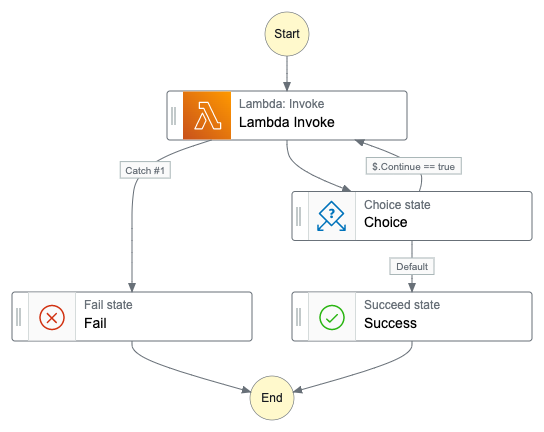

# lambdag

[](https://godoc.org/github.com/mashiike/lambdag)


[](https://github.com/mashiike/lambdag/blob/master/LICENSE)

DAG Execution for AWS StepFunctions with Lambda Function 

Motivation :

- Amazon State Language (ASL) data flow (InputPath, ResultPath,ResultSelector,etc...) was too difficult.
- AWS StepFunctions machine retry and error catching mechanisms are great!
- In the end, for difficult processes, it is tempting to rely on Lambda functions, but it is hard to create a Lambda function for each processing unit.
- Airflow's DAG was good, I want to write something like DAG in Golang

Ideas :

Let the AWS StepFunctions state machine concentrate on things outside of the pipeline logic, such as retries, SNS notifications, etc., and contain the pipeline logic in a single Lambda function. Then, the state machine should focus on invoking a single Lambda function.

## Usage 

So here is the simplest StateMachine example



[definition.asl.json](https://github.com/mashiike/lambdag/blob/main/_examples/definition.asl.json)

and, The Lambda function that this state machine invokes is written as follows

```go
package main

import (
	"context"
	"encoding/json"
	"log"
	"os"
	"os/signal"
	"syscall"

	"github.com/mashiike/lambdag"
)

func main() {
	ctx, cancel := signal.NotifyContext(context.Background(), syscall.SIGTERM, syscall.SIGINT, syscall.SIGHUP)
	defer cancel()
	dag, err := lambdag.NewDAG("SampleDAG")
	if err != nil {
		log.Fatal(err)
	}
	task1, err := dag.NewTask("task1", lambdag.TaskHandlerFunc(func(ctx context.Context, tr *lambdag.TaskRequest) (interface{}, error) {
		return `"task1 success"`, nil
	}))
	if err != nil {
		log.Fatal(err)
	}
	task2, err := dag.NewTask("task2", lambdag.TaskHandlerFunc(func(ctx context.Context, tr *lambdag.TaskRequest) (interface{}, error) {
		return "task2 success", nil
	}))
	if err != nil {
		log.Fatal(err)
	}
	err = task1.SetDownstream(task2)
	if err != nil {
		log.Fatal(err)
	}
	lambdag.RunWithContext(ctx, os.Args[1:], dag)
}
```


It is assumed to work with the runtime of the provided.al2

The build should look like this
```$shell 
$ GOOS=linux GOARCH=arm64 go build -o bootstrap _examples/src/main.go
```

To run the example in a Local environment using [StepFunctions Local](https://docs.aws.amazon.com/step-functions/latest/dg/sfn-local.html)

```shell
$ cd _examples
$ make prepare
$ make build
$ make run/<execution_name>
$ make history/<execution_name>
```

## Usage (for local development)

```go
lambdag.RunWithContext(ctx, os.Args[1:], dag)
```

if local execution run as CLI 
```shell
$ go run _examples/src/main.go 
Usage: SampleDAG <flags> <subcommand> <subcommand args>

Subcommands:
        commands         list all command names
        flags            describe all known top-level flags
        help             describe subcommands and their syntax
        render           rendering DAG
        serve            start a stub server for the lambda Invoke API
```

CLI has stub server for the lambda Invoke API

```shell
$ go run _examples/src/main.go serve
2022/06/17 13:51:55 [info] starting up with Stub lambda API http://:3001
```

```shell
aws lambda --endpoint http://localhost:3001 invoke --function-name SampleDAG --cli-binary-format raw-in-base64-out --payload '{"Comment":"this is dag run config"}' output.txt --log-type Tail --qualifier current
```
## LICENSE

MIT License

Copyright (c) 2022 IKEDA Masashi
